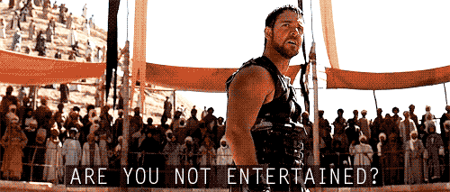

# ES6 CLASSES: Gladiator Arena ⚔ 🛡



The Emperor has commissioned you to build a Gladiator Arena!! You'll be using your newfound ability to create ES6 classes to help them out.

## ❗️ READING!

In preparation for tomorrow's lecture, we'd like you to read a couple of things:

- [Refresher on function basics](http://javascript.info/function-basics)
- [Refresher on DOM manipulation](http://javascript.info/modifying-document)

## ❗️ Before you start...

- You'll be working in both `gladiator.js` and `arena.js`. 
- Use `index.html` to test your code in Chrome Devtools.
- After each step, there's a block of code that you can copy & paste in your chrome devtools console to make sure you completed the step correctly!!!
- If you can't figure out one of the steps, try writing some pseudocode in a comment in your file. You never know, it may come to you...

## ❗️ Your submission should include...

- An issue ticket on the [ada-students repo](https://git.generalassemb.ly/nyc-wdi-ada/ada-students/issues/new)
- A link to your fork of this repository
- One question you have and one thing you learned based on the reading above.
- Completion, comfort, wins, losses, questions... you know the drill.

### 🚨🚨 This homework is due TONIGHT, 4/6, at 11PM!! 🚨🚨

# ⚔ INSTRUCTIONS ⚔

## Part 1 - The Gladiator

In `gladiator.js`, create a `Gladiator` class that has the following properties:

* a `name`
* a `weapon` (one of Spear, Club, Trident)

Run this code in the Chrome Devtools console to check that your Gladiator class is doing what the instructions are asking for. Make sure you're saving your files and refreshing the page...

```js
const max = new Gladiator('Maximus','Trident');
console.log(max.name); // should output the string "Maximus"
console.log(max.weapon); // should output the string "Trident"
```

> Ideally the Gladiator class shouldn't accept anything as a weapon except the strings `Spear`, `Club`, and `Trident`... head on down to [the bonus](#bonus-) if you want to tackle that now.

## Part 2 - The Arena

In `arena.js`, create an `Arena` class that meets the following conditions:

#### 1. An arena has a name

To check that it does, run this code in the Chrome Devtools console:

```js
const colosseum = new Arena('Colosseum');
console.log(colosseum.name); // => Colosseum
```
#### 2. The name should be capitalized

To check that it is...you know the drill 😉

```js
const colosseum = new Arena('megalopolis');
console.log(colosseum.name); // => Megalopolis
```

#### 3. An arena can have gladiators

```js
const colosseum = new Arena('Colosseum');
console.log(colosseum.gladiators); // => []
```

#### 4. You can add a gladiator to the arena


```js
const max = new Gladiator('Maximus', 'Trident');
const colosseum = new Arena('Colosseum');
colosseum.addGladiator(max);
console.log(colosseum.gladiators); // => [Gladiator]
```

#### 5. The arena should never have more than 2 gladiators in it at a time

```js
const max = new Gladiator('Maximus','Trident');
const titus = new Gladiator('Titus','Sword');
const andronicus = new Gladiator('Andronicus','Sword');
const colosseum = new Arena('Colosseum');
colosseum.addGladiator(max);
colosseum.addGladiator(titus);
colosseum.addGladiator(andronicus);
console.log(colosseum.gladiators.length); // => 2
```

#### 6. If there are two gladiators in the arena, you can call a `fight` method that results in the elimination of one of the gladiators from the arena.

  * Winning conditions:
    * Trident beats Spear
    * Spear beats Club
    * Club beats Trident
    * If the two gladiators have the same weapon, they are both eliminated.

(If you're having a rough time thinking through this, just think about Rock Paper Scissors...)

```js
const max = new Gladiator('Maximus','Trident');
const titus = new Gladiator('Titus','Spear');
const colosseum = new Arena('Colosseum');
colosseum.addGladiator(max);
colosseum.addGladiator(titus);
colosseum.fight();
console.log(colosseum.gladiators); // => [max]
```

## Bonus!!!!! 💪💪

How could you prevent creating Gladiators with a different weapon? e.g. `new Gladiator('J','Taco')` throws an error. (Maybe [MDN](https://developer.mozilla.org/en-US/docs/Web/JavaScript/Reference/Global_Objects/Error) has something to say about this...)

What other types of errors can you think of?? Here's a few:
- What if you try to add something to an arena's gladiators that's not an object created with the `Gladiator` class?
- What if you try to run the `fight` method without two gladiators in the arena?

## ✨ Double Bonus!!!!!!!! ✨

* Add a method to remove gladiators from the arena by name
* Update your winning conditions so that if the gladiator named "Maximus" is in the fight, he wins.
* Add a method to check to see if the crowd is entertained (`.entertained()`). The crowd is only entertained if Maximus is in the arena.
* Before a losing gladiator is eliminated, the user should be prompted to put their thumbs up or down. If user votes down, the losing gladiator is removed. If the user votes up, the gladiator stays in the arena and his opponent is removed. (Life isn't fair.)
